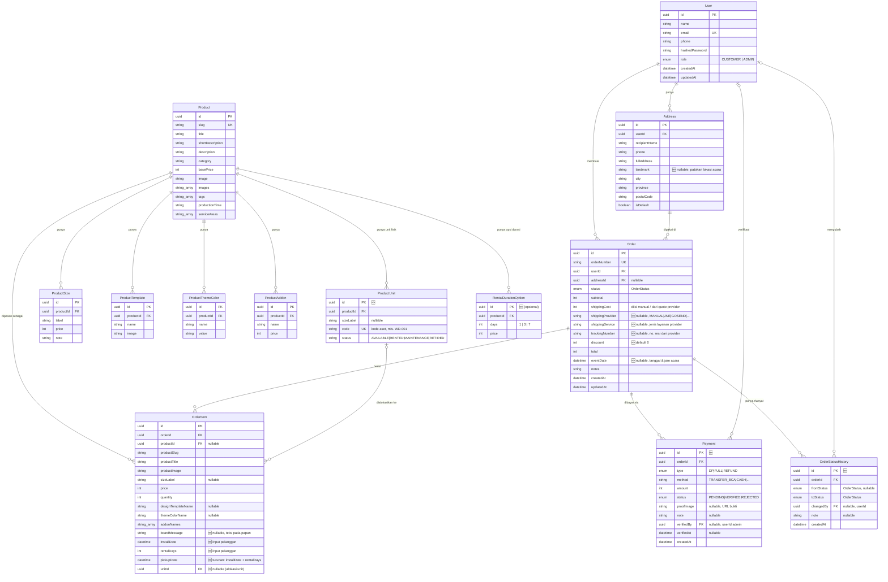

# ERD — Sistem Sewa Papan Bunga (Daffa Florist)

**Sumber:** [PRD-papan-bunga-sewa.md](PRD-papan-bunga-sewa.md) §7
**Basis schema:** [prisma/schema.prisma](../prisma/schema.prisma)
**Tanggal:** 3 Juni 2026
**Status:** Draft

> 🆕 = entitas/atribut baru untuk sistem sewa. Sisanya sudah ada di schema existing.
>
> **Tipe id:** semua kolom `id` (PK) & foreign key bertipe **`uuid`** native Postgres (`@db.Uuid`, di-generate `@default(uuid())`). Kode bisnis (`slug`, `email`, `orderNumber`, `code`) tetap `string`.

---

## 1. Diagram ER (Mermaid)



---

## 2. Enum OrderStatus (🆕 disesuaikan)

```
PENDING ──▶ CONFIRMED ──▶ SCHEDULED ──▶ INSTALLED ──▶ COMPLETED
   │                                                          
   └──────────────────────────────▶ CANCELLED (bisa dari status mana pun sebelum selesai)
```

| Status | Arti | Aktor & aksi pemicu |
|--------|------|---------------------|
| `PENDING` | Pesanan dibuat, menunggu pembayaran & verifikasi | Pelanggan checkout (`createRental`) — order lahir di status ini |
| `CONFIRMED` | Pembayaran (DP/lunas) terverifikasi | Admin memverifikasi bukti pembayaran |
| `SCHEDULED` 🆕 | Jadwal pemasangan papan ditetapkan | Admin menetapkan tanggal/slot tim pasang |
| `INSTALLED` 🆕 | Papan sudah terpasang di lokasi acara | Tim lapangan menandai setelah memasang |
| `COMPLETED` 🆕 | Pesanan tuntas | Admin menutup pesanan setelah masa sewa selesai |
| `CANCELLED` | Pesanan dibatalkan (dari status mana pun sebelum selesai) | Pelanggan/admin membatalkan |

> Hanya `CANCELLED` & `COMPLETED` yang dianggap **tidak aktif** (tak lagi menahan unit) saat cek ketersediaan (lihat §4). Status lain masih "memegang" unit pada periodenya.

> Status existing `PROCESSING / SHIPPED / DELIVERED` (model jual-putus) digantikan rangkaian status sewa di atas.

### Enum pembayaran (🆕)

```prisma
enum PaymentType {
  DP     // uang muka
  FULL   // pelunasan / bayar penuh
  REFUND // pengembalian (mis. pembatalan)
}

enum PaymentStatus {
  PENDING   // menunggu verifikasi admin
  VERIFIED  // bukti dikonfirmasi
  REJECTED  // bukti tidak valid
}
```

---

## 3. Relasi & Kardinalitas

| Relasi | Kardinalitas | Catatan |
|--------|--------------|---------|
| User → Address | 1 : N | Satu user banyak alamat |
| User → Order | 1 : N | Riwayat pesanan |
| Address → Order | 1 : N | `addressId` nullable di Order |
| Product → ProductSize / Template / ThemeColor / Addon | 1 : N | `onDelete: Cascade` |
| Product → ProductUnit 🆕 | 1 : N | Inventaris unit fisik per produk-ukuran |
| Product → RentalDurationOption 🆕 | 1 : N | Opsi durasi & harga sewa |
| Order → OrderItem | 1 : N | `onDelete: Cascade` |
| Product → OrderItem | 1 : N | `onDelete: SetNull` (jaga snapshot historis) |
| ProductUnit → OrderItem 🆕 | 1 : N (opsional) | `unitId` nullable; diisi saat unit dialokasikan |
| Order → Payment 🆕 | 1 : N | `onDelete: Cascade`; satu pesanan banyak transaksi (DP, pelunasan, refund) |
| User → Payment 🆕 | 1 : N (opsional) | `verifiedBy` nullable; admin yang memverifikasi bukti |
| Order → OrderStatusHistory 🆕 | 1 : N | `onDelete: Cascade`; audit trail tiap perubahan status |
| User → OrderStatusHistory 🆕 | 1 : N (opsional) | `changedBy` nullable; aktor perubahan status |

---

## 4. Inti Logika Sewa (di luar struktur tabel)

- **Periode tampil** sebuah item = `[installDate, pickupDate]`, dengan `pickupDate = installDate + rentalDays` (dihitung server saat `createRental`).
- **Cek ketersediaan** — sebuah `produk+sizeLabel` penuh untuk periode `[start, end]` bila jumlah `OrderItem` aktif (status ≠ `CANCELLED`/`COMPLETED`) yang **tumpang tindih** ≥ jumlah `ProductUnit` (atau `unitCount`).
  - Tumpang tindih: `requestStart <= existingEnd` **DAN** `requestEnd >= existingStart`.
  - Tambahkan **buffer** ±1 hari (konfigurasi) untuk pasang/bongkar.
- **Index disarankan (🆕)** untuk performa query ketersediaan/kalender:
  - `OrderItem(productId, installDate, pickupDate)`
  - `OrderItem(unitId)`
  - `ProductUnit(productId, sizeLabel, status)`

---

## 5. Catatan Implementasi

1. **Ketersediaan dua pendekatan** (PRD §7.4): mulai dari berbasis **jumlah unit** (`unitCount` di `Product`/`ProductSize`) yang lebih sederhana, lalu naik ke **`ProductUnit` per aset** saat butuh pelacakan kondisi per unit.
2. `pickupDate` **disimpan** (bukan dihitung saat query) demi kecepatan query kalender/ketersediaan; sumber kebenaran tetap `installDate + rentalDays`.
3. `RentalDurationOption` bersifat **opsional** — bila harga sewa cukup di-derive dari `basePrice`/`ProductSize`, model ini bisa ditunda.
4. Pertanyaan terbuka PRD §13 (pelacakan per aset sejak M1?) memengaruhi apakah `ProductUnit` wajib di M1.
5. **`Payment`** memisahkan transaksi dari pesanan: satu `Order` bisa punya DP → pelunasan → (refund bila batal). Status pembayaran pesanan diturunkan dari agregasi `Payment` yang `VERIFIED` (mis. `CONFIRMED` saat DP terverifikasi).
6. **`OrderStatusHistory`** dicatat otomatis di setiap `admin.order.updateStatus` (server) — bukan diinput manual. Berguna untuk audit (§5.2 A2) & menghitung metrik G4 (waktu pesan → konfirmasi).
7. **`OrderItem.boardMessage`** (§5.1 F3) — teks yang dicetak di papan, per item (tiap papan bisa beda). Berbeda dari `Order.notes` yang merupakan catatan umum pesanan.
8. **`Address.landmark`** & **`Order.eventDate`** (datetime, memuat jam) menutup form acara §5.1 F3 dan kebutuhan waktu di daftar tugas tim lapangan §5.2 A3.
9. **`Order.discount`** melengkapi ringkasan biaya §5.1 F4: `total = subtotal + shippingCost − discount`.

### Pengiriman (integrasi penyedia di masa depan)

- Rilis awal: `shippingCost` **diisi manual** oleh admin (sesuai zona layanan §10.8) — belum ada tabel zona.
- Masa depan (M5): **integrasi penyedia pengiriman**. Ongkir diambil dari API rate provider saat checkout, lalu disimpan ke `shippingCost`; `shippingProvider` / `shippingService` / `trackingNumber` di `Order` menyimpan hasilnya. Field-field ini sudah disiapkan (nullable) agar migrasi ke integrasi tidak mengubah struktur.
- Bila nanti perlu daftar tarif tetap per area sebelum integrasi penuh, baru tambahkan `ServiceZone` (opsional).
