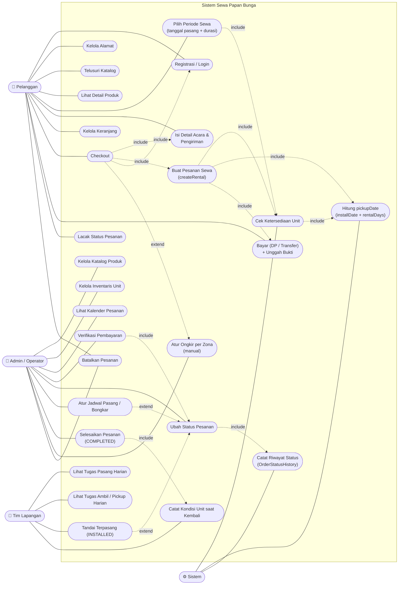

# Use Case Diagram — Sistem Sewa Papan Bunga (Daffa Florist)

**Sumber:** [PRD-papan-bunga-sewa.md](PRD-papan-bunga-sewa.md) §4–§6 · [ERD-papan-bunga-sewa.md](ERD-papan-bunga-sewa.md)
**Tanggal:** 21 Juni 2026
**Status:** Draft

> Aktor diturunkan dari PRD §4 (Persona). Use case diturunkan dari PRD §5 (Lingkup Fitur) & §6 (Alur Pengguna). Relasi `<<include>>` / `<<extend>>` mengikuti aturan bisnis PRD §6.3 & §10.

---

## 1. Aktor

| Aktor | Deskripsi (PRD §4) | Akses tRPC (ERD/PRD §8) |
|-------|--------------------|--------------------------|
| **Pelanggan** | Individu/perusahaan pemesan papan bunga | `publicProcedure` + `protectedProcedure` |
| **Admin / Operator** | Staf Daffa Florist (katalog, jadwal, verifikasi) | `adminProcedure` |
| **Tim Lapangan** | Petugas pasang & ambil papan | `adminProcedure` (subset: tugas & status lapangan) |
| **Sistem** *(aktor pendukung)* | Proses otomatis: hitung `pickupDate`, validasi ketersediaan transaksional, catat `OrderStatusHistory` | — |

---

## 2. Diagram Use Case (Mermaid)

---

## 3. Pemetaan Use Case ↔ Fitur PRD ↔ API tRPC

| Use Case | Fitur PRD | Procedure (PRD §8) |
|----------|-----------|---------------------|
| Registrasi / Login | F6 | `auth.register`, NextAuth Credentials |
| Kelola Alamat | F6 | (Address CRUD) |
| Telusuri Katalog / Detail Produk | F1 | `product.list`, `product.getBySlug` |
| Pilih Periode Sewa | F2 | `rental.getBookedDates` |
| Cek Ketersediaan Unit | F2, §6.3 | `rental.checkAvailability` |
| Hitung `pickupDate` | §7.3 | (server, saat `createRental`) |
| Isi Detail Acara & Pengiriman | F3 | (form checkout) |
| Kelola Keranjang | F4 | (client `useCart`) |
| Checkout / Buat Pesanan Sewa | F4, §6.1 | `order.createRental` |
| Bayar + Unggah Bukti | F4 | (Payment, verifikasi admin) |
| Lacak Status Pesanan | F5 | `order.listMine` |
| Batalkan Pesanan | §10.3 | `admin.order.updateStatus` |
| Kelola Katalog Produk | A1 | `admin.product.*` |
| Kelola Inventaris Unit | A1 | `admin.unit.*` |
| Lihat Kalender Pesanan | A2 | `admin.calendar`, `admin.order.list` |
| Verifikasi Pembayaran | A2 | `admin.order.updateStatus` |
| Ubah Status / Riwayat Status | A2, §ERD-5.6 | `admin.order.updateStatus` → `OrderStatusHistory` |
| Atur Jadwal Pasang / Bongkar | A3 | `admin.order.updateStatus` |
| Tugas Pasang / Ambil Harian | A3 | `admin.calendar` (filter tanggal) |
| Tandai Terpasang (INSTALLED) | A3, §6.2 | `admin.order.updateStatus` |
| Catat Kondisi Unit | A3 | (`ProductUnit.status`) |
| Selesaikan Pesanan | A4 | `admin.order.updateStatus` |
| Atur Ongkir per Zona | §10.8 | (manual, `Order.shippingCost`) |

---

## 4. Catatan Relasi

- **`<<include>>`** = perilaku wajib yang selalu dijalankan use case dasar:
  *Checkout* selalu meng-*include* pembuatan pesanan, validasi ketersediaan, dan login; *Verifikasi Pembayaran* selalu meng-*include* ubah status; tiap ubah status selalu meng-*include* pencatatan `OrderStatusHistory`.
- **`<<extend>>`** = perilaku kondisional/opsional:
  *Atur Jadwal Pasang* dan *Tandai Terpasang* memperluas *Ubah Status* (transisi `SCHEDULED`/`INSTALLED`); *Atur Ongkir per Zona* memperluas *Checkout* (rilis awal manual, PRD §10.8).
- **Aturan ketersediaan (PRD §6.3)** muncul dua kali: saat pratinjau (*Pilih Periode Sewa*) dan **wajib divalidasi ulang transaksional** saat *Buat Pesanan Sewa* untuk cegah double-booking (PRD §8 "Aturan kritis").
