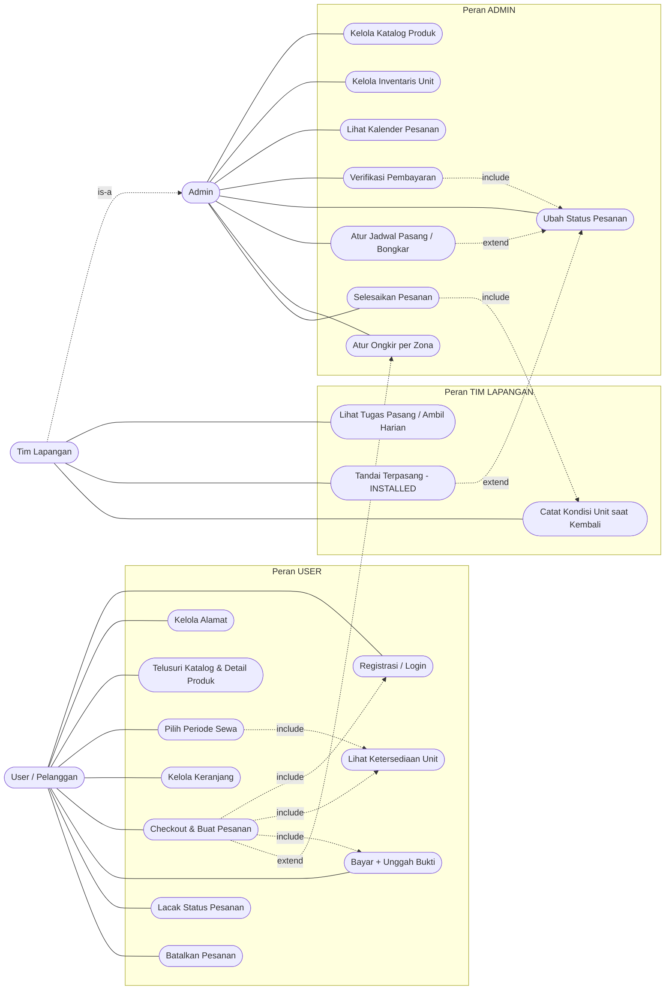

# Use Case Diagram — Sistem Sewa Papan Bunga (Daffa Florist)

**Sumber:** [PRD-papan-bunga-sewa.md](PRD-papan-bunga-sewa.md) §4–§6 · [ERD-papan-bunga-sewa.md](ERD-papan-bunga-sewa.md)
**Tanggal:** 21 Juni 2026
**Status:** Draft

> Diagram disusun **berbasis peran (role-based)**: tiap aktor punya kelompok use case sendiri.
> Aktor diturunkan dari PRD §4 (Persona), use case dari PRD §5 (Fitur) & §6 (Alur).

---

## 1. Aktor & Perannya

| Aktor | Peran | Hak akses |
|-------|-------|-----------|
| **User (Pelanggan)** | Memesan & menyewa papan bunga, bayar, lacak pesanan | `public` + login (`protected`) |
| **Admin** | Kelola katalog, unit, pesanan, pembayaran, jadwal | `admin` |
| **Tim Lapangan** | *Spesialisasi Admin* — eksekusi pasang/ambil di lapangan | `admin` (subset operasional) |

> **Tim Lapangan** adalah generalisasi/turunan dari **Admin**: ia mewarisi akses admin tetapi hanya memakai use case operasional lapangan.

---

## 2. Diagram Use Case (Mermaid)

---

## 3. Rincian Use Case per Peran

### 3.1 User (Pelanggan)
| Use Case | Fitur PRD | API tRPC |
|----------|-----------|----------|
| Registrasi / Login | F6 | `auth.register`, NextAuth |
| Kelola Alamat | F6 | Address CRUD |
| Telusuri Katalog & Detail Produk | F1 | `product.list`, `product.getBySlug` |
| Pilih Periode Sewa | F2 | `rental.getBookedDates` |
| Lihat Ketersediaan Unit | F2, §6.3 | `rental.checkAvailability` |
| Kelola Keranjang | F4 | client `useCart` |
| Checkout & Buat Pesanan | F4, §6.1 | `order.createRental` |
| Bayar + Unggah Bukti | F4 | Payment |
| Lacak Status Pesanan | F5 | `order.listMine` |
| Batalkan Pesanan | §10.3 | `admin.order.updateStatus` |

### 3.2 Admin
| Use Case | Fitur PRD | API tRPC |
|----------|-----------|----------|
| Kelola Katalog Produk | A1 | `admin.product.*` |
| Kelola Inventaris Unit | A1 | `admin.unit.*` |
| Lihat Kalender Pesanan | A2 | `admin.calendar`, `admin.order.list` |
| Verifikasi Pembayaran | A2 | `admin.order.updateStatus` |
| Ubah Status Pesanan | A2 | `admin.order.updateStatus` → `OrderStatusHistory` |
| Atur Jadwal Pasang / Bongkar | A3 | `admin.order.updateStatus` |
| Atur Ongkir per Zona | §10.8 | manual, `Order.shippingCost` |
| Selesaikan Pesanan | A4 | `admin.order.updateStatus` |

### 3.3 Tim Lapangan *(spesialisasi Admin)*
| Use Case | Fitur PRD | API tRPC |
|----------|-----------|----------|
| Lihat Tugas Pasang / Ambil Harian | A3 | `admin.calendar` (filter tanggal) |
| Tandai Terpasang (INSTALLED) | A3, §6.2 | `admin.order.updateStatus` |
| Catat Kondisi Unit saat Kembali | A3 | `ProductUnit.status` |

---

## 4. Catatan Relasi

- **Generalisasi** — *Tim Lapangan* **is-a** *Admin*: punya akun admin, tapi perannya dibatasi ke use case lapangan.
- **`<<include>>`** (wajib selalu jalan):
  *Checkout* → *Login* + *Lihat Ketersediaan* + *Bayar*; *Verifikasi Pembayaran* → *Ubah Status*; *Selesaikan Pesanan* → *Catat Kondisi Unit*.
- **`<<extend>>`** (kondisional):
  *Atur Jadwal* & *Tandai Terpasang* memperluas *Ubah Status* (transisi `SCHEDULED`/`INSTALLED`); *Atur Ongkir per Zona* memperluas *Checkout* (rilis awal manual, PRD §10.8).
- **Anti double-booking (PRD §6.3 & §8):** ketersediaan dicek dua kali — saat *Pilih Periode Sewa* (pratinjau) dan **divalidasi ulang transaksional** saat *Checkout & Buat Pesanan*.
