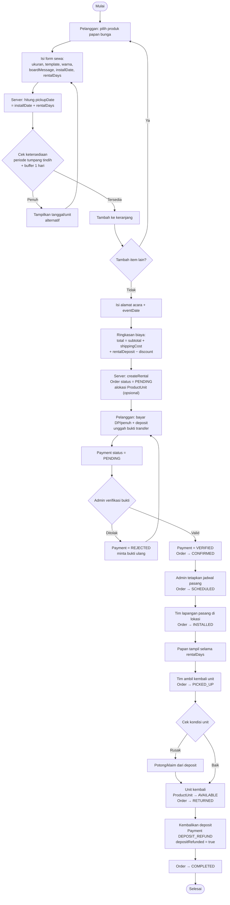
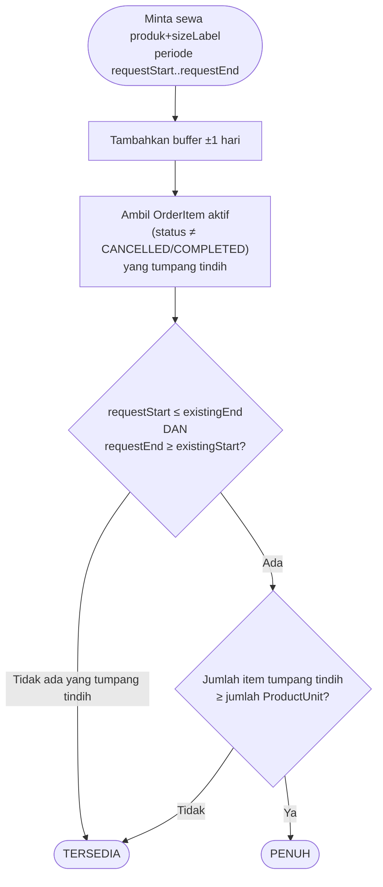
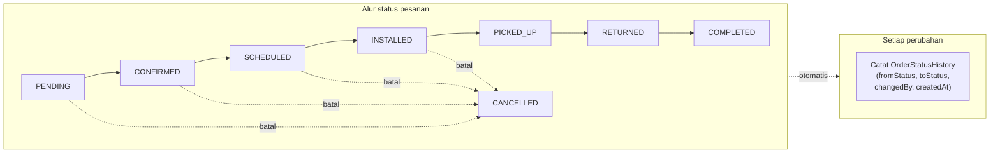

# Activity Diagram — Sistem Sewa Papan Bunga (Daffa Florist)

**Sumber:** [ERD-papan-bunga-sewa.md](ERD-papan-bunga-sewa.md) · [PRD-papan-bunga-sewa.md](PRD-papan-bunga-sewa.md)
**Tanggal:** 3 Juni 2026
**Status:** Draft

> Diagram memakai sintaks **Mermaid** (`flowchart`). Lihat bagian [Cara membuka](#cara-membuka-agar-terlihat-jelas) di bawah.

---

## 1. Alur Utama — Pemesanan Sewa (Pelanggan → Admin)

Dari awal pelanggan memilih produk sampai unit dikembalikan & deposit beres. Kolom (swimlane) menunjukkan siapa aktornya.



---

## 2. Sub-alur — Cek Ketersediaan (logika inti §4 ERD)



---

## 3. Sub-alur — Perubahan Status & Pembayaran (sisi Admin)



---

## Cara membuka agar terlihat jelas

File ini pakai **Mermaid**, jadi bisa langsung dirender (tidak perlu tool berbayar):

| Cara | Langkah |
|------|---------|
| **VS Code (rekomendasi)** | Install extension **"Markdown Preview Mermaid Support"** (bierner). Lalu buka file ini → `Cmd+Shift+V` untuk preview. Diagram langsung tampil. |
| **GitHub / GitLab** | Push file `.md` ini — Mermaid otomatis dirender di tampilan repo (tanpa setup apa pun). |
| **mermaid.live** | Buka <https://mermaid.live>, copy-paste isi satu blok ```mermaid``` → render + export PNG/SVG. Paling enak untuk presentasi/cetak. |
| **Export gambar** | Dari mermaid.live klik *Actions → PNG/SVG*, atau pakai CLI `@mermaid-js/mermaid-cli` (`mmdc -i file.md -o diagram.png`). |

> **Tips:** untuk preview di VS Code yang paling mulus, extension **"Mermaid Markdown Syntax Highlighting"** + **"Markdown Preview Mermaid Support"** sudah cukup. Kalau ingin diagram interaktif/zoom, mermaid.live paling nyaman.
